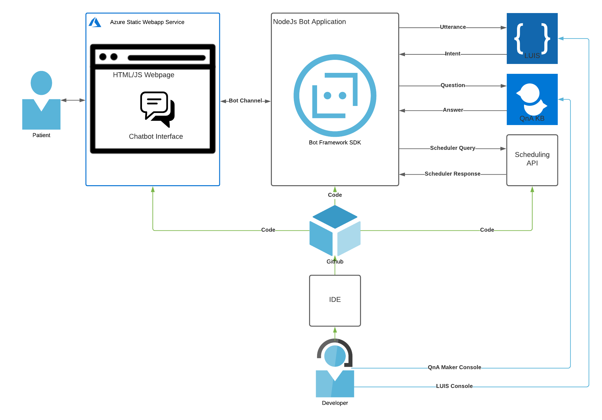

# Dental office virtual assistant

## Project brief

### 🏅Objective

> *What* you want to accomplish with the project. Like a destination on a map.

Build a customer-facing chatbot that answers to FAQ and books appointments.

### 🛣️ Key results

> *How* you want to fulfill the objective. List measurable outcome required to achieve the objective. They measure progress towards the objective.

1. Deploy resources on azure with terraform CDK
2.


### Data



---

## Getting started for devs

**Prerequisites**: Azure account, azure CLI, `az login` and Anaconda/Miniconda installed. Then run the following steps:

```bash
# create conda venv
conda env create -f conda.yaml
# init pre-commit
pre-commit install
pre-commit autoupdate
```

Create `.env` and insert necessary credentials.
